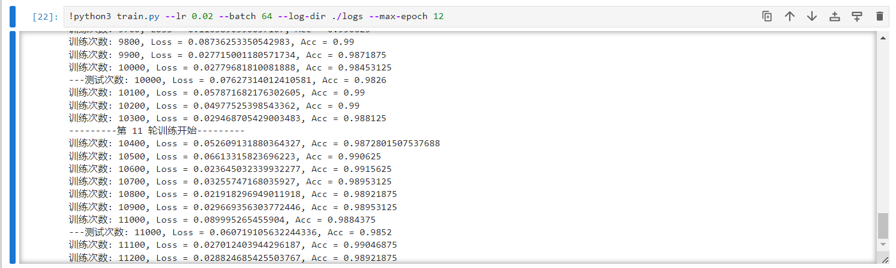
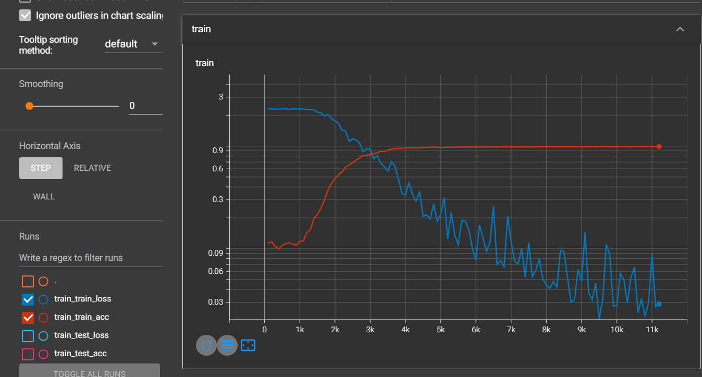
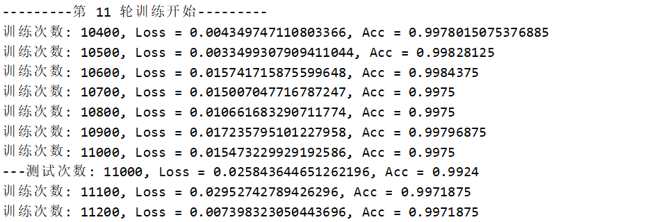
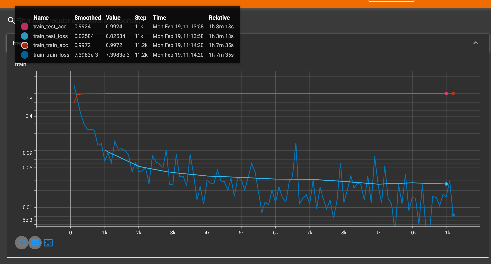

# Mnist-Numpy

#### 介绍
用numpy写的基本深度学习框架，用手写数字识别做的一个基本测试项目，暂且只实现了卷积神经网络的层和梯度下降优化。

#### 软件架构
Model.py 是模型的类
Layer.py 是层的类，包括
- Layer（基类）
- Linear（全连接层）
- Conv2d（二维卷积层）
- MaxPool2d（二维最大池化层）
- Sigmoid（Sigmoid激活函数层）
- ReLU（ReLU激活函数层）
- Softmax（Softmax输出层，包含了一个全连接层）
- Dorpout（Dorpout层）
- BatchNorm1d（一维的BN层，NxC）
- BatchNorm2d（二维的BN层，NxCxHxW）

#### 使用说明

1.  参考train.py，run.py两个代码
2.  模型再`model/`目录下

#### 模型现状

学习率为0.02时，训练12轮，大致收敛于99%

tensorboard的输出如上

##### Update - 2024.2.19
将网络中加入BatchNorm层，效果明显，学习率为0.05，训练12轮，最终正确率为99.71875%，损失函数为0.007398

